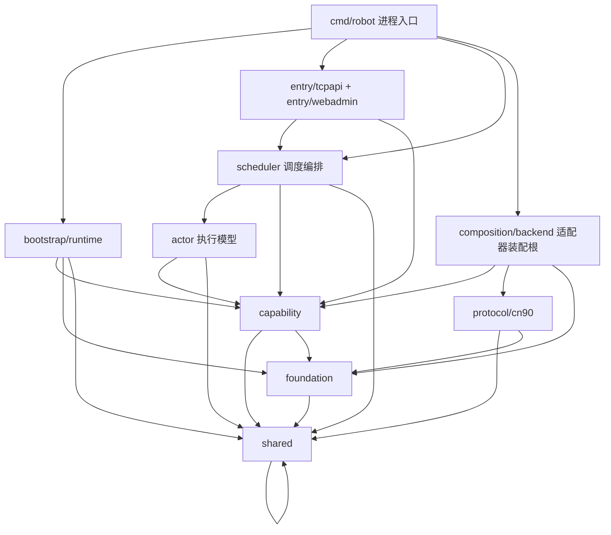

# dnf-robot-90cn 代码图谱

> 基线：`main @ 010393c`。本文是"观察全库"的地图：分层、构成、关键细节、设计理念与阅读路线。
> 规模：Go 文件 **346** 个 / **57,063** 行；其中测试 **166** 个 / **22,681** 行（约 40%）。
> 模块：`robot`（Go 1.26，单可执行 `cmd/robot`，依赖 `golang.org/x/text`、`modernc.org/sqlite`、`golang.org/x/sys`）。

---

## 一、总览

```text
dnf-robot-90cn/
├─ cmd/robot/            进程入口与装配根（backend-neutral + 一个装配文件）
├─ internal/
│  ├─ architecture/       分层/规整的自动执法测试（不可绕过）
│  ├─ bootstrap/runtime/  运行目录初始化、后端运行时标记与切换
│  ├─ entry/              tcpapi（机器人控制 API）、webadmin（内嵌 Web 控制台）
│  ├─ scheduler/          编排核心：调度器、Actor 宿主、自适应策略、命令入口
│  ├─ actor/              执行模型：Actor 循环/状态机/Ledger/在线准入消费端
│  ├─ capability/         11 个业务能力子包（与版本无关的编排）
│  ├─ composition/backend/适配器注册表 + cn90 适配器（版本特化总入口）
│  ├─ protocol/cn90/     90CN 线路协议（帧/opcode/UDP/花名册）
│  ├─ shared/             零依赖公共契约（端口、状态、命令、能力矩阵）
│  └─ foundation/         14 个基础设施子包（锁/日志/配置/布局/网络/进程…）
├─ deploy/build-robot.bat 构建脚本（产物输出到仓库外 deploy/windows）
├─ doc/                   全量文档（禁止 README 碎片化）
└─ .github/workflows/     发布流水线
```

一句话：**公共层表达业务意图，适配层负责协议与存储实现**；调度层自适应地驱动 Actor，Actor 通过共享端口味问适配器。

---

## 二、分层图谱（依赖方向）



### 层依赖白名单（`internal/architecture/dependencies_test.go` 强制执行）

| 层目录 | 允许导入的 internal 层 |
|---|---|
| `internal/bootstrap` | capability, foundation, shared |
| `internal/composition` | composition, capability, foundation, protocol, shared |
| `internal/entry` | scheduler, capability, foundation, shared |
| `internal/scheduler` | scheduler, actor, capability, foundation, shared |
| `internal/actor` | capability, foundation, shared |
| `internal/capability` | capability, foundation, shared |
| `internal/protocol` | protocol, foundation, shared |
| `internal/foundation` | foundation, shared |
| `internal/shared` | （无，零依赖） |

方向要点：**shared 是唯一零依赖层**；foundation 不反向依赖业务；scheduler 不得引用具体适配器；capability 不知道协议与数据库实现；entry 只消费 scheduler 的投影。

### 架构执法测试（15 条"硬规则"，`internal/architecture`）

1. `internal/` 下不允许出现未登记的新层目录。
2. 每个层的 import 白名单（上表）。
3. `ActionResult.State` 在 actor/scheduler/robotaction/store 里必须用命名常量，禁止字面量。
4. Actor/Ledger/PointCoordinator 的锁字段必须"用途命名"，禁止 `mu`。
5. 裸 `sync.Mutex/RWMutex` 只允许出现在 `foundation/lockhub`。
6. `database/sql` 只允许出现在 `cmd/robot` 与 `composition/backend/cn90`。
7. `.go` 文件名禁止 `compat/temp/legacy/bridge/adapter/misc/helper` 等临时结构词。
8. `cmd/robot` 仅 `runtime_main.go` 可引用具体适配器（其他文件保持 backend-neutral）。
9. 全库禁止 `README.md`（文档统一进 `doc/规整文档.md` 等）。
10. 仓库内禁止运行产物（`.bak/.jsonl/.log/.tmp`）。
11. `scheduler` 不得在 `RobotManager` 上暴露 `Online/Logout/Move/Shout/Store` 等动作门面（必须走 managed command 或能力服务）。
12. scheduler 与公共层不得出现 `90CN/sim_90cn/protocol/cn90` 等具体后端 token。
13. Web 运行时代码禁止后端类型判断，必须消费 scheduler 投影；`app.js` 不得构建平行运行状态源。
14. scheduler 的锁资源必须使用命名常量，禁止字面量 `WithResource("scheduler"…)`。
15. 运行状态缓存只能有一个 owner：`scheduler/runtime_status.go` 的 `runtimeStateTable.snapshot`，入口处必须 `CopyRuntimeStatusMap`。

---

## 三、启动与生命周期

```text
robot main
  ├─ -hash-password CLI（离线生成 WebPasswordHash）
  └─ runMain
      ├─ ensureWindowsRuntime        # 进程边界限制（当前发行版仅 Windows）
      ├─ config.LoadConfig(config.ini) → layout.New(configDir).Ensure()
      ├─ loadBackendSelection(state/backend_selection.json)
      ├─ backendregistry.Select(id)  # 得到 BackendInfo（能力矩阵/设置项）
      ├─ runtimeinit.PrepareBackendRuntime # 版本/配置代数变化时重放适配器默认文件
      ├─ robotlog.ConfigureLogRotation + LogInit(logs/robot.log)
      ├─ foundationlog.SetRobotSink(robotlog)   # 统一日志汇聚
      └─ runBackend（可返回 2 = 后端重初始化，外层循环重来）
          ├─ InitConfigForBackend（释放 robot_config.ini / 名字与喊话模板）
          ├─ loadRequiredRobotConfig + EnsureOpenFileLimit(max_online_robots)
          ├─ scheduler.NewRobotManager(nil, cfg, nil)
          ├─ cn90backend.ComposeRuntime(...)   # PVF→DB→状态→载具→协议传输
          ├─ MarkBackendRuntimeApplied
          ├─ 端口接线（全部只挂 shared 端口）：
          │    ConfigureBackendRuntime / StorePolicy / FollowAccountLocator /
          │    SetBackendRobotCreator / SetRobotStateDirectory /
          │    SetBackendActionTransport / SetBackendSessionTransport /
          │    SetTownMapCatalog / SetBackendRobotCleaner / SetBackendRobotPurger /
          │    SetBackendPopulationInspector
          ├─ TCP 控制 API（0.0.0.0:RobotPort，默认 8111）
          ├─ Web 控制台（127.0.0.1:RobotPort 内部代理 + 0.0.0.0:WebPort，默认 8112）
          ├─ manager.StartAutoActions()          # 创建 Supervisor 并启动调度
          └─ 等待 signal / Web LifecycleAction
              └─ 关闭顺序（LIFO）：
                 Web 停止 → TCP 停止 → manager.Shutdown()（停新任务 → 编排停止 →
                 文件观察停止 → 邮件等待 → store 点缓存落盘 → 位置批处理器关闭）
                 → adapter bundle.Close() → robotlog.LogClose()（日志最后关）
```

生命周期纪律：**初始化 → 调度 → 结束**；结束必须"停止新工作 → 完成有界在途 → 持久化必要状态 → 关闭传输 → 最后关日志"。

---

## 四、调度层内部结构（核心）

### 4.1 角色分工

| 文件/组件 | 职责 |
|---|---|
| `scheduler/core.go` | `RobotManager`：全局状态宿主。持有配置快照、后端端口、自适应缓存、在线准入闸门、运行状态表、操作跟踪、后台任务 |
| `scheduler/supervisor.go` | `RobotSupervisor`：1 秒 tick 的自适应调度循环 |
| `scheduler/supervisor_scaling.go` | 目标维持：actor 扩容/缩容、建号（provision）、分配 UID、autoStop 分批下线 |
| `scheduler/supervisor_guards.go` | guard 序列：auto 关闭 / 游戏门 / 结构操作 / 端口不稳 / breaker |
| `scheduler/supervisor_lease_health.go` | 租约体检、坏租约清理、unhealthy 回收与冷却 |
| `scheduler/adaptive_policy.go` | 自适应策略：模式决策 + 全量调节参数（速率/批次/间隔/退避/熔断） |
| `scheduler/auto_metrics.go` | 指标采样、窗口增量、AutoBreaker 判定与暂停、RobotMetrics 输出 |
| `scheduler/online_gate.go` | 在线尝试准入：令牌桶 + 在飞上限 + breaker 检查 |
| `scheduler/actor_runtime.go` | `RobotRuntime`：Actor 访问调度器的端口（动作、状态、准入、attempt 记账） |
| `scheduler/runtime_status.go` | 运行状态唯一 owner（`runtimeStateTable.snapshot`） |
| `scheduler/position_batcher.go` | 位置写入批处理与重试退避 |
| `actor/*` | Actor 执行模型：循环、状态机、Ledger、失败分级、退避消费 |
| `scheduler/commands.go` | 手动/自动化命令入口（OnlineManaged/MoveManaged/LogoutManaged…） |
| `scheduler/lifecycle.go` | 结构操作与容器操作的跟踪（维护模式） |

### 4.2 Supervisor tick 顺序（每秒）

```text
ReapDoneDraining
→ adaptiveSchedulerSignals        # 读取上一窗口指标/资源/端口/actors
→ refreshAdaptiveRobotConfig      # 由 adaptive_policy 产出本次有效配置 rc
→ updateSchedulerStatus           # 写入统一调度状态（Web/日志投影）
→ 系统公告 / 邮件通知（有节奏）
→ handleAutoGuards                # 命中即 return：
      auto 关闭 / 游戏门不可用 / 结构操作中 / 端口不稳 / breaker 中
→ AdoptManualActors
→ maintainTarget                  # actor 槽位收敛到 target
→ releaseBrokenLeases             # 租约与内存目录核对
→ cleanupBlockedUIDs(10)          # 被隔离 UID 的清理
→ recycleUnhealthyActors          # 仅 data 类失败 + 回收冷却
→ recycleDesiredOfflineAutoActors
→ assignIdleAutoActors            # 先 provision（建号），再 lease+assign（上线）
→ updateMetrics                   # 窗口统计、AutoBreaker、RobotMetrics
```

### 4.3 Actor 执行模型

- 每个槽位一个 goroutine（`actor_loop.go`）：`select { stop / ctrl / cmd / poll timer }`。
- 状态机：`idle → assigned/offline → online → running → busy → releasing`（`actor_state.go`）。
- Actor 不直连协议：动作经 `RobotRuntime`（`actor_runtime.go`）→ 能力服务 → 适配器端口。
- 在线尝试由**调度层准入闸门**控制：`TryAcquireOnlineAttempt`（令牌桶 + 在飞上限 + breaker），失败按指数退避 + 抖动，绝不因 transport 失败删档。

### 4.4 自适应调度

模式：`bootstrap / fill / stable / store_expand / pressure / breaker / maintenance / manual`。

| 模式 | 触发（信号） | 主要动作 |
|---|---|---|
| bootstrap | 无实时快照 | 输出基础参数，等待首个窗口 |
| fill | `running+connecting < target` | 提高 batch/rate，加 actor |
| stable | `running ≈ target` | 维持；store 目标/概率归零 |
| store_expand | 健康在线且 store 有缺口 | 提高 store 并发与概率（需声明能力） |
| pressure | 在线失败率高 / 连接积压 / 资源压力 / 待分配积压 | 降 batch/rate、拉伸重试退避、缩在飞数、拉长移动与 store 间隔 |
| breaker | 失败窗口 >50%（真实登录尝试）或端口/连接异常 | 暂停新工作；在线失败暂停 60s 起、连续失败递增到 300s；不续期，到期探测 |
| maintenance | 结构操作（建号/删号/清理/危险删除）进行中 | 暂停分派，保留必要清理 |
| manual | `auto_actions=false` | 分批收敛 actor，停止新工作 |

关键自适应参数（运行时由策略计算，配置里是基线与上下限）：
`online_batch_size / online_start_rate / online_fill_timeout_sec`、
`online_retry_base_ms / max_ms / jitter_percent / online_in_flight`、
`online_breaker_pause_sec`、`create_batch_size`、`scale_down_batch`、`recycle_cooldown_sec`、
`bad_failures / bad_recover_sec / store_concurrent / breaker_* / port_down_release_batch`。

### 4.5 失败分级与回收

| 失败类别 | 判定 | 处理 |
|---|---|---|
| transport | 超时/拒绝/服务器慢（默认） | 指数退避（5s→…→15min，带抖动）；会话掉线也记一次，避免立刻重连 |
| data | 角色不存在、身份冲突、职业/创建类错误 | 允许进入回收（删档重建），回收后 UID 冷却（默认 600s），冷却期内再失败只隔离不重建 |

### 4.6 统一状态与投影

- `runtime_status.go` 的 `runtimeStateTable` 是在线状态唯一 owner（入口 copy，出口快照）。
- `RobotManager.SchedulerStatus()/AutoStatus()/SystemStatus()/DatabaseStatus()` 是 Web/API 的统一投影。
- `RobotMetrics` 是一行结构化运行摘要（见"可观测性"）。

---

## 五、能力层与适配边界

### 5.1 capability 子包（11 个）

| 子包 | 职责 |
|---|---|
| `robot` | 领域类型：Info/CommandRequest/ActionResult/RuntimeStatus/能力常量/SchedulerStatus/AutoStatus |
| `robotconfig` | 运行时配置：INI 解码、校验、归一化、调度策略纯函数（target/限速/退避）、配置文本更新 |
| `robotaction` | 动作服务：在线/下线/移动/喊话（桥接调度端口） |
| `robotlifecycle` | 机器人协议计划与批量创建编排（BuildProtocolRobotPlans / ProvisionProtocolBatch） |
| `robotstate` | 内存目录：机器人注册表、身份目录、位置更新、创建批次 |
| `robotspawn` | 出生点分布（矩形采样/分布） |
| `robottemplate` | 名字与喊话模板（选择与安全过滤） |
| `catalog` | 模板/PVF 目录加载与缓存（职业、等级经验、地图、队伍技能） |
| `equipment` | 装备槽位构建/校验/修复的纯业务规则 |
| `pvf` | PVF 解析与投影（归档、角色/技能/任务门/地图/道具行、JSON 导出） |
| `store` | 摆摊/交易点领域（点位协调、占用、网格、货品、称号、世界喇叭缓存、准备与恢复流程） |

### 5.2 shared 契约（零依赖）

`BackendInfo / BackendCapability / CapabilityMatrix / BackendSelection / BackendSetting`、
`RuntimeOnlineUser / RuntimeMoveCommand / RuntimeShoutCommand`、
`RobotSession / SessionFactory / OpenSessionRequest`、
`RuntimeStatus / RuntimeStatusSummary / CommandRequest / ActionResult`、
`StorePolicy / AreaPolicy（GenericAreaAllowed）/ PartySkillMatch / SkillState / BackendRuntime`。

### 5.3 适配器（`composition/backend/cn90`）

| 文件 | 职责 |
|---|---|
| `descriptor.go` | 适配器身份 `sim_90cn`、能力矩阵、设置项（服务目录/游戏地址/端口/数据库） |
| `runtime_assembly.go` | `ComposeRuntime`：PVF→数据库→启动对账→状态→载具→创建器→清理器→分析器 |
| `session.go` | 打开会话：登录→选角→就绪→进城镇→保活（含会话级观测者） |
| `transport.go` | 动作传输与会话表（move/shout/status/locationKnown） |
| `provision.go` / `creator.go` | 角色创建协议与批量创建（含身份/载具回滚） |
| `delete.go` / `purge.go` | 协议删角与 SQLite 危险删除（含启动角色清点） |
| `startup_inventory.go` | 启动对账：扫描/收养/删除不完整账号，产出内存目录 |
| `loadout.go` | SQLite 载具应用器（装备/时装/宠物/属性/技能，单写者队列） |
| `growth.go` / `quests.go` | 转职/觉醒对账、任务门播种 |
| `population.go` / `follow_account.go` | 人口报告、跟随账号定位 |
| `persistence_executor.go` | 串行持久化执行器（队列 64，db 写的统一入口） |
| `dungeon_follower.go` | 队伍跟随（队长位置/区域投影） |
| `pvf_archive.go` / `pvf_catalog.go` | 服务端 PVF 定位与投影（遵循 `PVF_ARCHIVE_PATH`） |
| `store_policy.go` | 摆摊失败码分级（0x13/0x15/0x16 终态，0x14/0x3e/0x52/0xbe 可重试） |
| `protocol/cn90` | 线路协议：`client.go`（TCP 客户端）、`codec.go`（帧/opcode）、`party_udp.go`（队伍位置面）、`roster.go`（账号花名册） |

### 5.4 能力矩阵（`sim_90cn` 声明）

| 能力 | 状态 |
|---|---|
| Provision（建号） | ✅ |
| TownMove（城镇移动/坐标与区域切换） | ✅ |
| DungeonFollow（副本跟随） | ✅ auto_accept |
| Party（组队） | ✅ follower |
| GuildInvite（工会邀请） | ✅ auto_accept |
| Shout（普通喊话） | ✅ 仅区域频道 |
| WorldShout / PartyDebug / MailNotification / Diagnostics / SystemAnnouncement / ServiceControl / DungeonMove / Market | ❌ 显式 unsupported（返回统一 unsupported，Web 隐藏/置灰） |
| Cleanup（协议删角） | ✅ |
| DangerousDelete（适配器 SQLite 清理） | ✅ |
| Database（SQLite 健康检查） | ✅ sqlite_health |

> Store/Skill 等能力由 `CapabilityMatrix` 默认未启用，调度与 Web 按声明决定是否暴露；能力状态文档见 `doc/90CN能力状态.md`。

---

## 六、数据与持久化

- 数据库边界：`database/sql` 仅允许出现在 `cmd/robot` 与 `composition/backend/cn90`（架构测试强制）。
- 目标库：服务端 `Data/inventory.db`（可用 `INVENTORY_DATABASE_PATH` 或适配器设置覆盖），启动时校验 schema。
- 写路径：统一经 `persistenceExecutor`（单 worker、队列 64、可取消、panic 隔离），避免并发写与服务器争锁；连接使用 `busy_timeout=5000`。
- 主线写操作：启动对账删除、角色创建/载具写入、转职/觉醒对账、任务门播种、危险删除。
- 机器人运行态不落库：Actor/Ledger/身份目录是内存权威（`robotstate.MemoryStore`）。

### 配置与运行文件布局（`foundation/layout`，根 = 可执行文件旁的 `config/`）

```text
config/
├─ conf/     config.ini、robot_config.ini
├─ templates/ 名字模板、喊话模板、商店称号、队伍技能目录
├─ pvf/      pvf_manifest.json、装备目录、可堆叠目录、地图目录
├─ state/    backend_selection.json、backend_runtime.json、store_points_cache.json
├─ logs/     robot.log（轮转）
└─ tmp/
```

---

## 七、网络与协议

### 7.1 入站控制 API（TCP，默认 8111）

帧：`<tw><c>命令</c><json>{...}</json></tw>` → `<tw><result>{...}</result></tw>`。

| 分组 | 命令 |
|---|---|
| 机器人 | `createRobots`、`robotsOnline(Async)`、`robotsMove`、`robotsShout(World/Local)`、`robotsStore(Async)`、`robotsStatus`、`robotsLogout(Async)`、`cleanupRobots(Async)`、`robotsStore` |
| 自动化 | `autoStart`、`autoStop`、`robotConfigGet`、`robotConfigUpdate` |
| 危险操作 | `dangerousDeleteUnlock`（口令 123 → 单次 token）、`dangerousDeleteAsync`（range/uid/cid） |
| 队伍 | `partySkillReload`、`partyDebugStart/Stop/Status` |
| 系统 | `dashboardStatus`、`autoStatus`、`schedulerStatus`、`operationStatus`、`systemStatus`、`systemAnnouncement`、`databaseStatus`、`populationReport`、`goroutineDump` |
| 协议 | `05`（保活确认）、`sys` |

路由带能力门禁（`commandCapabilities`）与游戏运行时门禁（`RequiresGameRuntime`）；长任务走异步队列（`async.go`）。

### 7.2 Web 控制台（HTTP，默认 8112）

内嵌静态资源（`app.js/index.html/app.css/i18n.js/login.html`），同源校验 + 密码会话；`robot_proxy.go` 把 `/api/call` 转发到 8111；`backend_selection.go` 提供服务端目录/主机/端口/数据库设置与"重初始化"生命周期动作；`background_supervisor.go` 管理后台任务；`web_templates.go` 管理页面。

### 7.3 出站 90CN 协议

TCP 客户端（登录/选角/连接检查/位置/区域切换/喊话/注册 UDP）、队伍 UDP 位置面、副本跟随投影；位置写入由 `position_batcher` 合并、重试（250ms→2s 退避）。

---

## 八、可观测性

`RobotMetrics`（`logs/robot.log`，默认每 10s 一行）：

```text
policy / target / actors / leased / idle
state idle assigned online running busy releasing
runtime running / store / connecting / recycling / blocked
cpu / mem_mb / goroutines
online=累计成功/失败  online_window=窗口成功/失败
online_attempt_window=真实登录尝试窗口  online_inflight   online_retry_base_ms
move / shout_local / shout_world / store / expired
db_ms / db_ok / log_mb
```

三个只读视图：`dashboardStatus`（auto/system/scheduler/database）、`schedulerStatus`（模式/原因/全部调节参数）、`robot.log`（生命周期、断线、回收、熔断、指标）。

排查入口速查：
- "上不去"：`online_window`/`online_attempt_window` → breaker 原因 → 服务器选角延迟；
- "人数掉"：`online_lost` / `KEEPALIVE_STALLED` / `recycle_*` / `scale_down`；
- "卡死"：`policy=maintenance` 的结构操作、`blocked_*`、`goroutineDump`；
- "DB 问题"：`databaseStatus`、`db_ms`、`SQLITE_BUSY`。

---

## 九、设计理念（从代码与执法测试中提炼）

1. **契约先行，分层执法**：shared 零依赖；15 条架构测试让"分层"成为编译期之后仍不可绕过的硬约束。
2. **版本特化不出适配器**：opcode、表名、PVF 规则、路径、能力声明全部在 `composition/backend/cn90` 与 `protocol/cn90`。
3. **能力即许可**：适配器声明能力与模式；不支持统一返回 unsupported，Web 隐藏/置灰，调度不越权。
4. **调度自适应**：速率、批次、退避、熔断、建号/缩容节奏全部由策略层计算，执行器只消费；目标固定，只调节尝试速率与在途量。
5. **单一状态源**：运行状态只有一个 owner；Web/日志/API 只读投影，禁止平行缓存。
6. **锁纪律**：统一 `lockhub` 命名资源、用途命名的字段、短持有、锁内不做网络/等待/不可控 IO。
7. **生命周期有序**：初始化 → 调度 → 结束；关闭按"停新 → 等在途 → 持久化 → 关传输 → 关日志"。
8. **失败分级**：transport 只退避、data 才回收；回收带冷却；会话掉线也计入退避，杜绝重试风暴。
9. **有界并发**：闸门（令牌桶 + 在飞上限 + breaker）、建号/删除/缩容全部限速分批，避免把下游打爆。
10. **可测试与可观测**：端口注入、内存 fake、166 个测试文件；指标是一行可解析的结构化日志。
11. **文档不碎片化**：禁止 README，统一 `doc/`；本文即"全库地图"入口。

---

## 十、阅读路线与热点

### 10.1 建议阅读顺序（新人 10 步）

1. `doc/架构设计.md`（3 分钟建立分层心智）
2. `internal/shared/backend.go`（能力与后端契约）
3. `internal/composition/backend/cn90/descriptor.go`（这个适配器能做什么）
4. `cmd/robot/runtime_main.go`（装配根：所有端口如何接上）
5. `internal/scheduler/supervisor.go`（每秒发生什么）
6. `internal/scheduler/adaptive_policy.go`（自适应怎么算）
7. `internal/actor/actor_loop.go` + `actor_state.go`（Actor 怎么跑）
8. `internal/scheduler/online_gate.go` + `actor_actions.go`（在线准入与退避）
9. `internal/composition/backend/cn90/session.go`（一次登录/选角全流程）
10. `internal/architecture/*_test.go`（这些规则为什么存在）

### 10.2 复杂度热点（按行数）

| 文件 | 行数 | 说明 |
|---|---|---|
| `composition/backend/cn90/loadout.go` | 1040 | 装备/时装/宠物/属性写入（含迁移与修复） |
| `capability/pvf/pvf_parse.go` | 1030 | PVF 二进制解析 |
| `actor/ledger.go` | 723 | 租约/状态/回收的并发核心 |
| `capability/store/coordinator.go` | 710 | 交易点协调 |
| `composition/backend/cn90/startup_inventory.go` | 695 | 启动对账与目录重建 |
| `scheduler/core.go` | 559 | 调度器全局状态 |
| `capability/store/workflow.go` | 558 | 摆摊流程 |
| `scheduler/actor_runtime.go` | 522 | Actor↔调度端口 |
| `scheduler/lifecycle.go` | 509 | 结构操作跟踪 |
| `scheduler/adaptive_policy.go` | 373 | 自适应核心 |

### 10.3 测试地图（166 个测试文件，按主题）

- 架构执法：`internal/architecture`（分层、锁、SQL 边界、命名、Web 投影）。
- 调度：`scheduler/*_test.go`（自适应、压力、breaker、闸门、租约、位置批处理）。
- Actor：`actor/*_test.go`（重连、退避、回收清理、命令队列、party 等待）。
- 适配器：`composition/backend/cn90/*_test.go`（会话、传输、创建、删除、对账、载具、持久化边界）。
- 能力：`capability/**/*_test.go`（PVF、商店、配置、状态、模板、装备）。
- 入口：`entry/*_test.go`（帧协议、鉴权、代理、模板）、`cmd/robot/*_test.go`（生命周期进程级）。
- 协议：`protocol/cn90/*_test.go`（编解码、客户端、UDP、花名册、实盘回归标记）。

### 10.4 常见改动落点（"我要改 X 该动哪"）

| 目标 | 落点 |
|---|---|
| 新增/调整调度节奏 | `scheduler/adaptive_policy.go` + `capability/robotconfig/{runtime_config,defaults,load,scheduler_policy}.go` |
| 新动作/新命令 | `capability/robotaction/*` → `scheduler/commands.go` → `entry/tcpapi/robot_commands.go`（+ `commandCapabilities`）→ `webadmin/assets/app.js` |
| 新适配器 | 复制 `composition/backend/*` 与 `protocol/*`，实现 shared 端口，注册进 `composition/backend/registry.go`；不得在其他层加版本判断 |
| 改数据库/对账 | `composition/backend/cn90/{startup_inventory,loadout,growth,quests,purge}.go`（`database/sql` 边界内） |
| 改协议 | `protocol/cn90/{codec,client,party_udp,roster}.go` |
| 改运行目录/配置 | `foundation/layout` + `bootstrap/runtime/defaults` |
| 改 Web | `entry/webadmin/{server,robot_proxy,backend_selection,auth}.go` + `assets/*`（保持消费 scheduler 投影） |

---

## 附：模块规模一览（按目录，含测试）

| 目录 | 文件 | 行数 |
|---|---|---|
| `internal/capability`（11 子包） | 87 | 18,012 |
| `internal/scheduler` | 73 | 11,461 |
| `internal/composition/backend/cn90` | 47 | 10,435 |
| `internal/foundation`（14 子包） | 54 | 4,908 |
| `internal/actor` | 14 | 3,274 |
| `internal/entry` | 25 | 2,950 |
| `internal/protocol/cn90` | 12 | 2,806 |
| `cmd/robot` | 10 | 1,004 |
| `internal/shared` | 18 | 984 |
| `internal/architecture` | 2 | 727 |
| `internal/bootstrap` | 4 | 502 |
| **合计** | **346** | **57,063**（测试 22,681，约 40%） |

> 统计口径：`rg -c "^"` 行数汇总（含注释与空行），文件数来自 `git ls-files` / `rg --files`。
